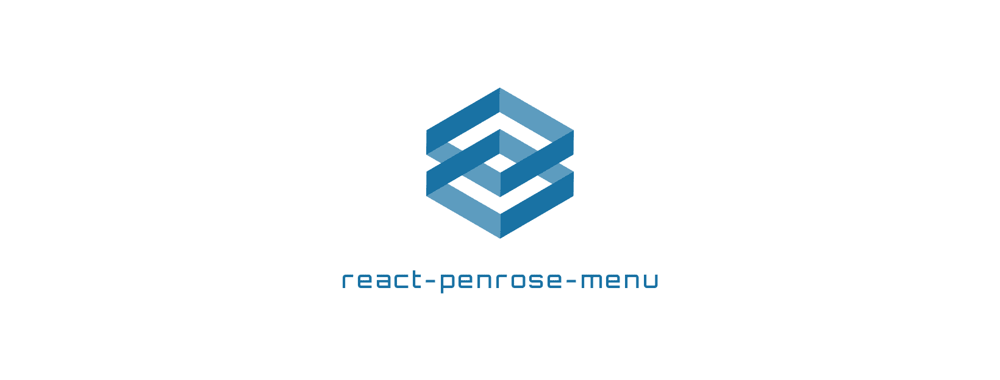

# Introduction
{: .fs-9 }

Endless Menu for React.
{: .fs-6 .fw-300 }

[Get started now]({{ site.baseurl }}){: .btn .btn-primary .fs-5 .mb-4 .mb-md-0 .mr-2 } [View on GitHub](https://github.com/oev-berlin/react-penrose-menu){: .btn .fs-5 .mb-4 .mb-md-0 }

---

## Features

- Lorem ipsum

---

## About the project

react-penrose-menu is &copy; {{ "now" | date: "%Y" }} by [OEV digital campus 360](https://digitalcampus360.de/).

### License

Distributed by an [MIT license](https://github.com/oev-berlin/react-penrose-menu/tree/main/LICENSE.txt).

### Contributing

When contributing to this repository, please first discuss the change you wish to make via issue,
email, or any other method with the owners of this repository before making a change. Read more about becoming a contributor in [our GitHub repo](https://github.com/oev-berlin/react-penrose-menu).

#### Thank you to the contributors!

<ul class="list-style-none">

  <li class="d-inline-block mr-1">
     
  </li>

</ul>

### Code of Conduct

[View our Code of Conduct](https://github.com/oev-berlin/.github/blob/main/CODE_OF_CONDUCT.md) on our GitHub repository.
